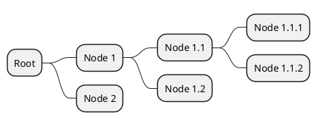
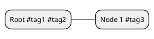

# plantuml-mindmap-loader

## Purpose

This plugin allows importing **PlantUML mind map diagrams** as JS objects with [webpack](https://webpack.js.org). Instead of parsing the diagrams at runtime, the diagrams are parsed at build time and the resulting JS objects are bundled with the rest of the code.

The story of creation of this plugin is described in the blog post: [Medium](https://hopefullysurprising.medium.com/building-a-typescript-compatible-webpack-loader-a-plantuml-mind-map-example-c0b3ec9bc033), [dev.to](https://dev.to/hopefully_surprising/building-a-typescript-compatible-webpack-loader-a-plantuml-mind-map-example-49jl), [personal blog](https://hopefullysurprising.com/custom-webpack-loader-plantuml-mindmap/).

## IMPORTANT

This package is not implementing the entire variety of PlantUML diagrams. It only implements the basic use of mindmap diagram - OrgMode syntax.

See OrgMode syntax in official [PlantUML documentation](https://plantuml.com/mindmap-diagram).

It can process PlantUML diagrams like this:



## Installation steps

1. `npm install --save-dev plantuml-mindmap-loader`
2. Add the loader to your webpack config:

```javascript
module.exports = {
  ...
  module: {
    rules: [
      {
        test: /\.mindmap.puml$/,
        use: 'plantuml-mindmap-loader'
      },
    ]
  },
```

## Usage

### Basic usage

Add a `.mindmap.puml` file to your project and import it like this:

```javascript
import treeMindMap from "./tree.mindmap.puml";

export function printTree() {
  console.log(JSON.stringify(navigationMindMap, null, 2));
}
```

When ran, it will produce:

```json
{
  "id": 3,
  "label": "Root",
  "tags": [],
  "children": [
    {
      "id": 4,
      "label": "Node 1",
      "tags": [],
      "children": [
        {
          "id": 5,
          "label": "Node 1.1",
          "tags": [],
          "children": [
            {
              "id": 6,
              "label": "Node 1.1.1",
              "tags": [],
              "children": []
            },
            {
              "id": 7,
              "label": "Node 1.1.2",
              "tags": [],
              "children": []
            }
          ]
        },
        {
          "id": 8,
          "label": "Node 1.2",
          "tags": [],
          "children": []
        }
      ]
    },
    {
      "id": 9,
      "label": "Node 2",
      "tags": [],
      "children": []
    }
  ]
}
```

*Note:* The `id` property is added automatically to each node. It is the number of the line where the node is defined in the diagram.

### Tags

The mind map parser supports tags. Tags are added to the diagram like this:



These tags will be present in `tags` property of the respective nodes:

```json
{
  "id": 3,
  "label": "Root",
  "tags": [
    "#tag1",
    "#tag2"
  ],
  "children": [
    {
      "id": 4,
      "label": "Node 1",
      "tags": [
        "#tag3"
      ],
      "children": []
    }
  ]
}
```
